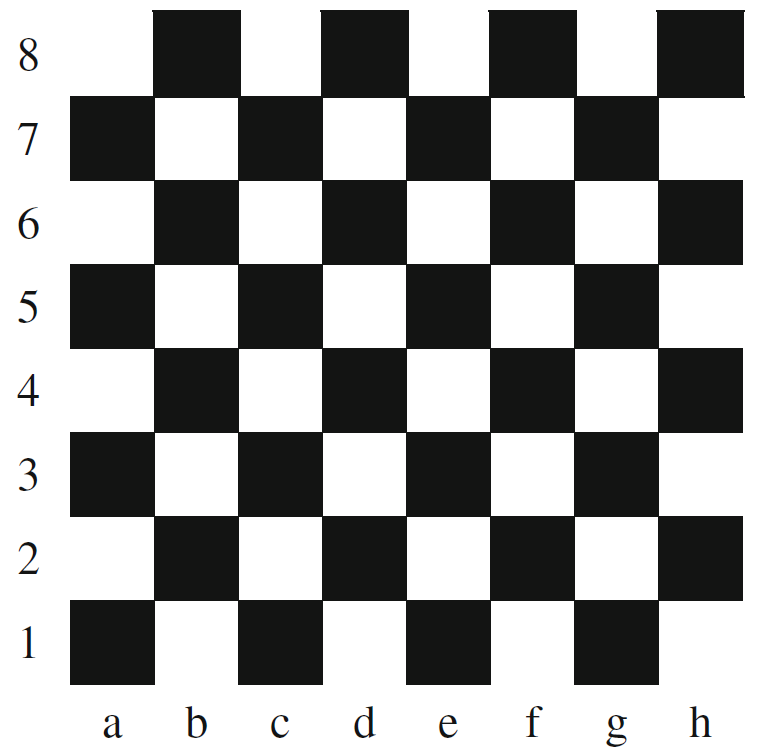

# What Color is that Square?

Positions on a chess board are identified by a letter and a number. The letter identifies
the column, while the number identifies the row, as shown below:

Write a program that reads a position from the user. Use an if statement to determine
if the column begins with a black square or a white square. Then use modular
arithmetic to report the color of the square in that row. For example, if the user enters
a1 then your program should report that the square is black. If the user enters d5
then your program should report that the square is white. 

## Extra Mile or Two

Validate the user entered a valid position.

> Tip: Validate is the first character is a valid letter (a - h) and the second character is a number between 1 and 8.
