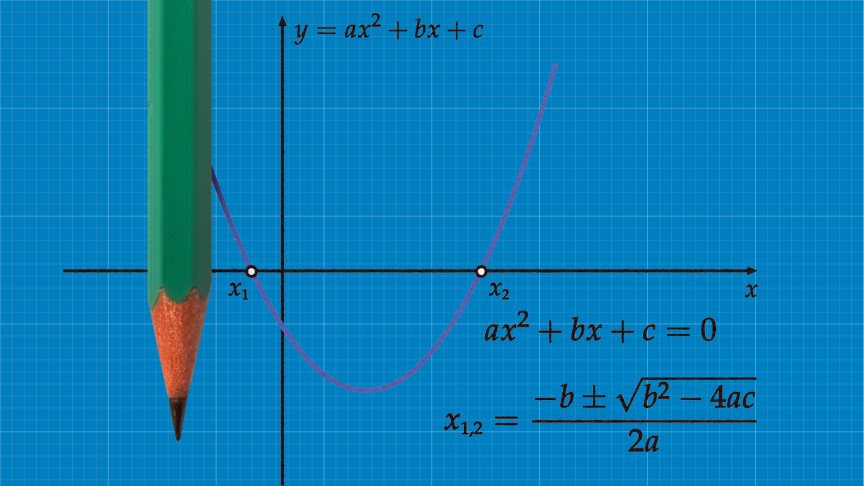

# Roots of a Quadratic Function

A univariate quadratic function has the form f (x) = ax^2 + bx + c, where a, b and c are constants, and a is non-zero. The roots of a quadratic function can be found by finding the values of x that satisfy the quadratic equation ax^2 + bx + c = 0. A quadratic function may have 0, 1 or 2 real roots. These roots can be computed using the quadratic formula, shown below:

    

The portion of the expression under the square root sign is called the discriminant.   

If the discriminant is negative then the quadratic equation does not have any real roots.

If the discriminant is 0, then the equation has one real root. Otherwise the equation has two real roots, and the expression must be evaluated twice, once using a plus sign, and once using a minus sign, when computing the numerator.

Write a program that computes the real roots of a quadratic function.Your program should begin by prompting the user for the values of a, b and c. Then it should display a message indicating the number of real roots, along with the values of the real roots (if any).

## Source

The Python Workbook, Ben Stephenson