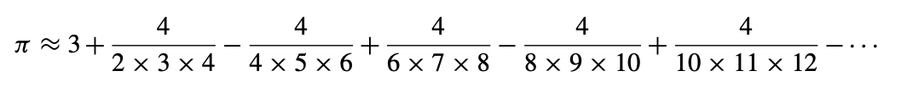

# Approximate πx

The value of π can be approximated by the following infinite series:

Write a program that displays 15 approximations of π. The first approximation should make use of only the first term from the infinite series. Each additional approximation displayed by your program should include one more term in the series, making it a better approximation of π than any of the approximations displayed previously.

## Source

The Python Workbook, Ben Stephenson